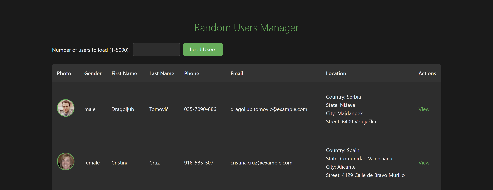
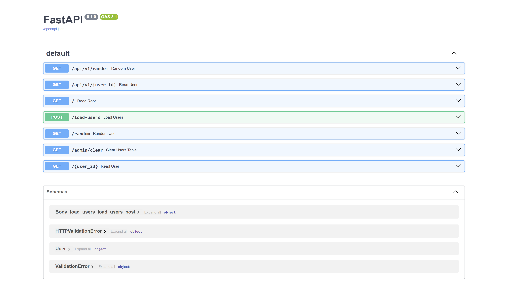

<div align="center">

   <h1>✨ Random Users Manager ✨</h1>



*A web application for fetching and managing random user data*

</div>

## 🛠 Технологический стек

### Выбор FastAPI и PostgreSQL: Обоснование

**Выбор технологий:**  
FastAPI был выбран благодаря своей высокой производительности, native-поддержке асинхронности и автоматической генерации документации, что критично для API-интерфейсов. PostgreSQL — как надежная реляционная СУБД с богатым функционалом, строгой типизацией и отличной масштабируемостью, идеально подходящая для хранения структурированных данных пользователей. Вместе они образуют оптимальный стек для высоконагруженных приложений: FastAPI обеспечивает быструю обработку запросов, а PostgreSQL — целостность и эффективный доступ к данным.  

### 📊 Почему не Django/Flask?

| Параметр               | FastAPI                | Django                 | Flask                      |
|------------------------|------------------------|------------------------|-----------------------------|
| **Для этого проекта**  | ✅ Идеально           | ❌ Избыточно           | ⚠️ Не хватает возможностей |
| **API-разработка**     | ✅ Специализированный | ⚠️ MVC-ориентированный | ⚠️ Минималистичный         |
| **Производительность** | ⚡️ Лучшая в Python    | 🐢 Средняя             | 🚀 Хорошая                 |
| **Асинхронность**      | ✅ Полная             | ❌ Частичная           | ❌ Нет                     |

### 📊 Почему не MySQL/SQLite?

| Параметр               | PostgreSQL                                    | MySQL                         | SQLite                             |
|------------------------|-----------------------------------------------|-------------------------------|------------------------------------|
| **Для этого проекта**  | ✅ Идеально                                   | ⚠️ Подходит                  | ❌ Не подходит                     |
| **Производительность** | ⚡️ Высокая (сложные запросы)                  | 🚀 Быстрая (простые запросы) | 🐢 Низкая (однопоточность)         |
| **Масштабируемость**   | ✅ Превосходная                               | ⚠️ Средняя                   | ❌ Очень ограниченная              |
| **Типы данных**        | ✅ Богатый выбор                              | ⚠️ Базовые типы              | ❌ Минимальный набор               |
| **Конкурентный доступ**| ✅ Полная поддержка MVCC                      | ⚠️Ограниченная               | ❌ Блокировка всей БД              |
| **Расширяемость**      | ✅ Возможность добавления функций на C/Python | ❌ Ограниченная              | ❌ Нет                             |
| **Транзакции**         | ✅ Полная ACID-совместимость                  | ⚠️ Зависит от движка         | ✅ ACID (но глобальная блокировка) |

### 🔧 Общий Технологический стек

| Категория           | Технологии             | Назначение                                 |
|---------------------|------------------------|--------------------------------------------|
| **🌐 Backend**     | FastAPI                | Веб-фреймворк для API                      |
|                     | SQLAlchemy + asyncpg   | Асинхронная работа с PostgreSQL            |
|                     | Pydantic               | Валидация и сериализация данных            |
| **🎨 Frontend**    | Jinja2                 | Генерация HTML-страниц                     |
| **💾 База данных** | PostgreSQL             | Хранение данных пользователей              |
| **🧰 Утилиты**     | httpx                  | Запросы к RandomUser API                   |
| **🧪 Тестирование**| pytest                 | Тестирование и генерация тестовых данных   |

## 🚀 Инструкция по запуску проекта

### 1. Клонирование репозитория

```bash
git clone https://github.com/MorozkoArt/randomuser-manager.git
cd randomuser-manager
```

### 2. Создание виртуального окружения

```bash
# Windows:
python -m venv venv
venv\Scripts\activate

# Linux/MacOS:
python3 -m venv venv
source venv/bin/activate
```

### 3. Установка зависимостей

```bash
pip install -r requirements.txt
```

### 4. Настройка окружения

1. Создайте файл `.env` из примера:

   ```bash
   # Linux/MacOS/WSL:
   cp .env.example .env

   # Windows (PowerShell):
   Copy-Item .env.example -Destination .env

   # Альтернатива для всех ОС:
   # 1. Вручную создайте файл .env
   # 2. Скопируйте содержимое из .env.example
   ```

2. Отредактируйте `.env` (укажите свои параметры БД):

   ```env
   DB_USER=postgres
   DB_PASSWORD=ваш_пароль
   DB_HOST=localhost
   DB_PORT=5432
   DB_NAME=имя_вышей_бд
   ```

### 5. Настройка базы данных

1. Убедитесь, что PostgreSQL запущен
2. Создайте базу данных:

```bash
# Linux/MacOS/WSL:
sudo -u postgres psql -c "CREATE DATABASE randomusers;"

# Windows (cmd с правами администратора):
psql -U postgres -c "CREATE DATABASE randomusers;"

# Альтернатива через pgAdmin (для всех ОС)
```

### 6. Запуск

1. Запуск приложения

   ```bash
   uvicorn main:app --reload
   ```

   Убедитесь, что порт (по умолчанию - 8000) не занят, иначе используйте другой, например порт - 8001:

   ```bash
   uvicorn main:app --reload --port 8001
   ```

2. Запуск тестов

   ```bash
   pytest
   ```

### 7. Доступ к приложению

Откройте в браузере: <http://localhost:8000>

## 🌐 Реализация Endpoints

### 1. Главная страница с таблицей пользователей `GET /`

- Пагинация (20 пользователей на странице)
- Форма для загрузки новых пользователей

```python
@router.get("/", response_class=HTMLResponse)
async def read_root(request: Request, page: int = 1, db: AsyncSession = Depends(get_db)):
   repo = UserRepository(db)
   per_page = 20
   total_users = await repo.count_users()
   users = await repo.get_users(skip=(page - 1) * per_page, limit=per_page)

   """ остальной код ..."""
```

### 2. Загрузка пользователей `POST /load-users`

- Валидация ввода (1-5000 пользователей)
- Асинхронная загрузка из RandomUser API

```python
@router.post("/load-users")
async def load_users(
         request: Request,
         count: int = Form(...),
         db: AsyncSession = Depends(get_db)
):
   repo = UserRepository(db)
   
   users = await repo.get_users()
   per_page = 10
   current_page = 1
   total_pages = max(1, (len(users) + per_page - 1) // per_page)

   """ остальной код ..."""
```

### 3. Просмотр конкретного пользователя `GET /{user_id}`

  

- Полная информация о пользователе
- Увеличенное фото

```python
@router.get("/{user_id}", response_class=HTMLResponse)
async def read_user(user_id: int, request: Request, db: AsyncSession = Depends(get_db)):
   repo = UserRepository(db)
   user = await repo.get_user(user_id)
   if not user:
      raise HTTPException(status_code=404, detail="User not found")
   return templates.TemplateResponse(request, "user_detail.html", {"user": user})
```

### 4. Случайный пользователь `GET /random`

- При каждом обновлении - новый пользователь

```python
@router.get("/random", response_class=HTMLResponse)
async def random_user(request: Request, db: AsyncSession = Depends(get_db)):
   repo = UserRepository(db)
   user = await repo.get_random_user()
   if not user:
      raise HTTPException(status_code=404, detail="No users found")
   return templates.TemplateResponse(request, "user_detail.html", {"user": user})
```

### 5. Очистка БД `GET /admin/clear` (Дополнительный Endpoint, для удобного тестирования)

- полностью очищает БД, удаляет всех пользователей

```python
@router.get("/admin/clear")
async def clear_users_table(db: AsyncSession = Depends(get_db)):
   try:
      await db.execute(text("TRUNCATE TABLE users RESTART IDENTITY CASCADE"))
      await db.commit()

      """ остальной код ..."""
```

### Отображение в Swagger



## 🧪 Тестирование

### 🛡️ Изолированная тестовая среда

- **SQLite in-memory база** (`sqlite+aiosqlite:///:memory:`)  
  *Полная изоляция тестов без side-эффектов:*

  ```python
   @pytest_asyncio.fixture(scope="session")
   async def db_engine():
      engine = create_async_engine(
         "sqlite+aiosqlite:///:memory:",
         connect_args={"check_same_thread": False}
      )
      
      async with engine.begin() as conn:
         await conn.run_sync(Base.metadata.create_all)
      
      yield engine
      
      await engine.dispose()
   ```

- **Мокирование внешнего API** через `pytest-httpx`  

  ```python
  def test_load_users(httpx_mock):
      httpx_mock.add_response(json={
          "results": [{
              "gender": "female",
              "name": {"first": "Test", "last": "User"},
              "email": "test@example.com"
          }]
      })
  ```

### ✅ Что тестируется

1. **API Endpoints**:
   - `GET /` (пагинация)
   - `GET /random` (случайный пользователь)
   - `GET /user/{id}` (детали пользователя)
   - `POST /load-users` (загрузка новых данных)

2. **Интеграции**:
   - Работа с БД (SQLAlchemy)
   - Валидация данных (Pydantic)
   - Обработка ошибок (404, 422 и др.)

3. **Frontend**:
   - Корректность HTML-шаблонов
   - Отображение данных пользователя
